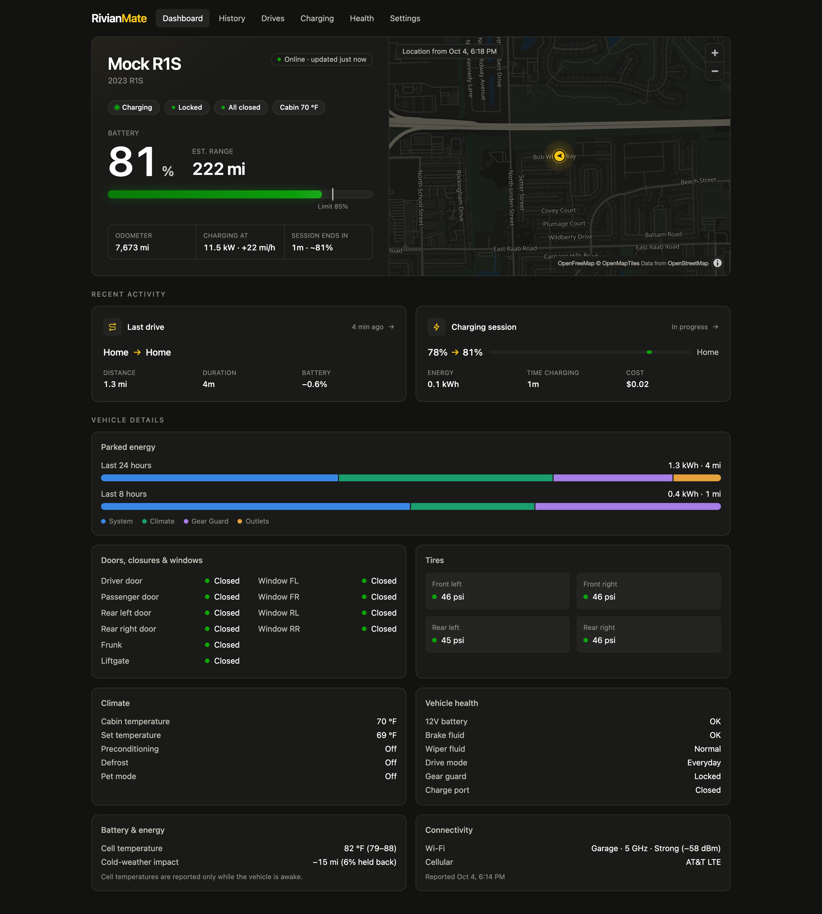
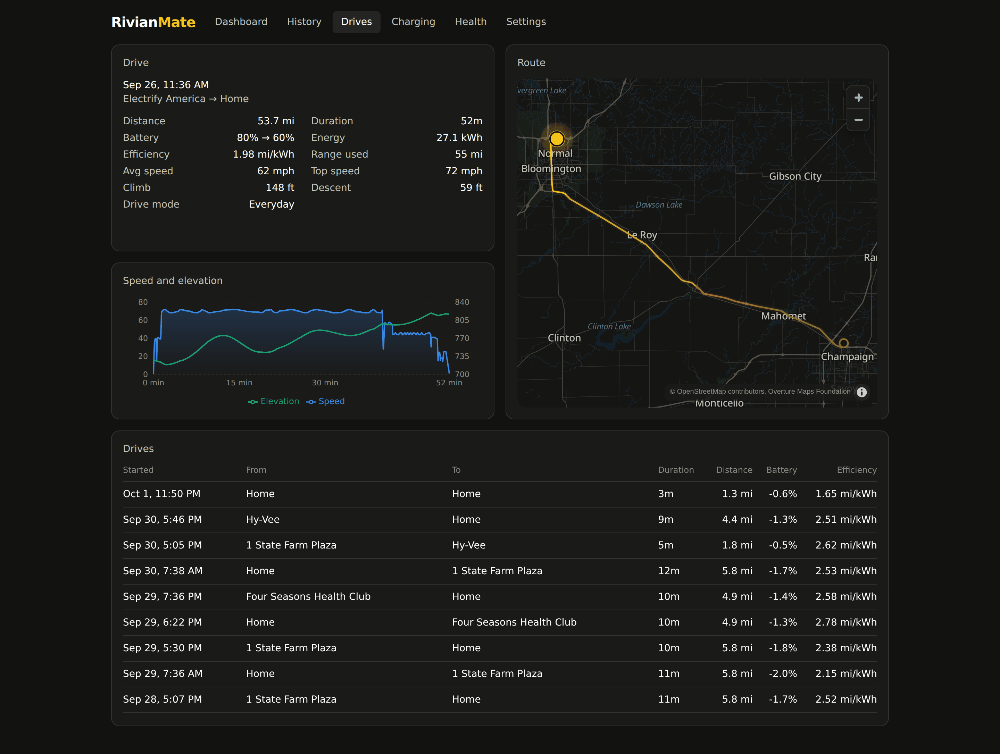
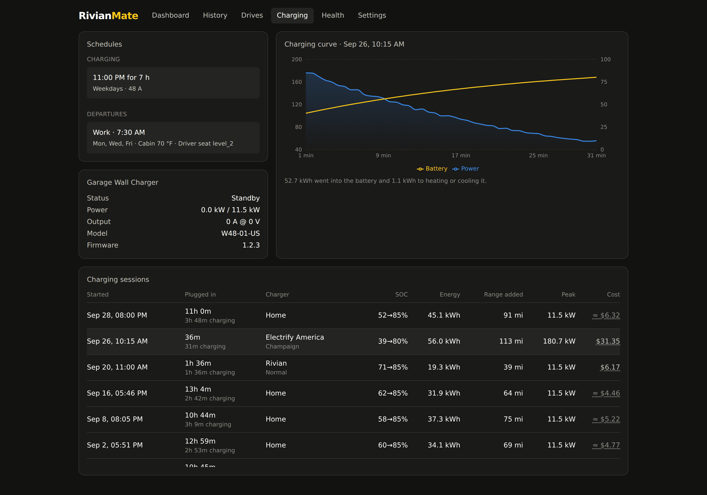
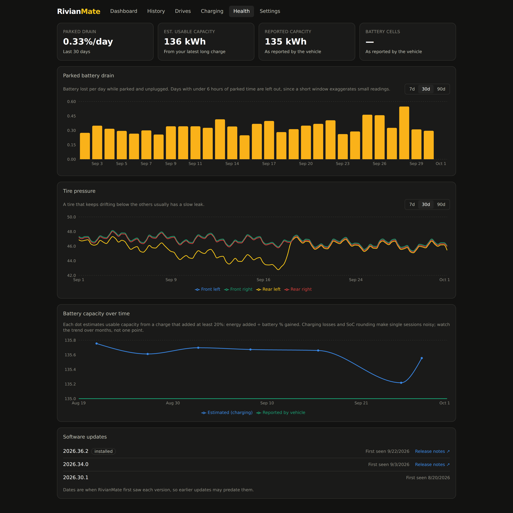
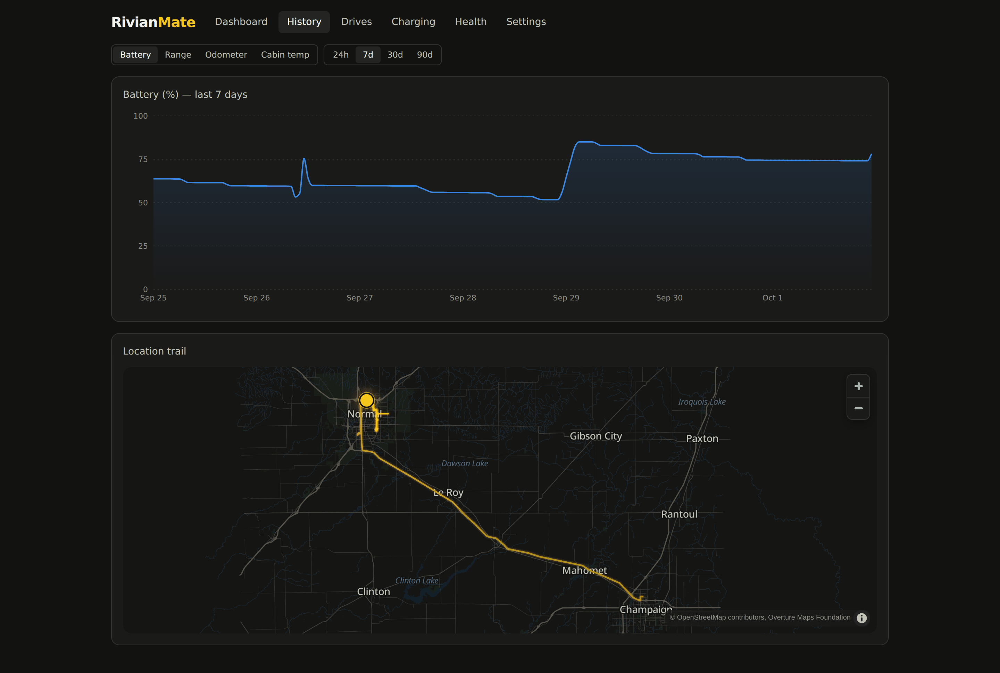

# RivianMate

**A self-hosted data logger and dashboard for your Rivian.** RivianMate stays
connected to your vehicle through Rivian's cloud and records drives, charging
sessions, battery health, and vehicle state in your own Postgres database. It
then shows them on a dashboard you can open from anywhere.



- **Your data, your server.** One Docker Compose file runs the app and its
  database. Nothing is sent to a third-party service.
- **Read-only and gentle.** RivianMate never sends commands to the vehicle. It
  keeps its Rivian traffic low so your phone app keeps working.
- **Standalone.** It's a single web app, written in TypeScript end to end.

> Screenshots show the built-in demo mode: a simulated R1S with six weeks of
> history around Bloomington–Normal, Illinois. Map data © OpenStreetMap
> contributors, OpenMapTiles, and the Overture Maps Foundation.

## Contents

- [Features](#features)
- [Quick start](#quick-start)
- [Configuration](#configuration)
- [Updating](#updating)
- [Privacy and security](#privacy-and-security)
- [Development](#development)
- [License](#license)

## Features

### Live dashboard

Battery, range, charge limit, and odometer, with the vehicle on a themed map
that follows it as it drives. Every door, window, and closure (frunk,
tailgate, tonneau, gear tunnel) is shown and adjusts to your model. The
dashboard also shows tire pressures, climate, software version, drive mode,
and active navigation with arrival time and battery on arrival. Battery
details include cell temperature and cold-weather range impact, and bars
show the energy used while parked over the last 24 and 8 hours, split into
system, climate, Gear Guard, and outlets. Updates are pushed to the browser
as they arrive, and a freshness badge shows how recent the data is.

### Drives



Drives are detected automatically from gear, power state, and speed. Each one
records distance, duration, battery and energy used, efficiency, average and
top speed, climb and descent, and drive mode. Its route is drawn on the map,
and a chart plots speed and elevation along the way. Start and end points
show as **Home** or a looked-up address (optional, via OpenStreetMap), and
navigation destinations are recorded too.

### Charging



Every session is logged with plug-in and charging time, SoC gained, energy,
range added, peak power, and cost. You can see the full power curve for each
session, with a bar splitting the energy added into what was stored and what
went to heating or cooling the pack. Charging history from your Rivian
account is imported automatically, so public sessions from before you
installed RivianMate appear too, with Rivian's prices. Set your home
electricity rate to get estimated costs for home sessions. The page also
shows your charging and departure schedules and the status of a Rivian Wall
Charger.

### Health



Vehicle-reported parked energy by use, tire pressure trends that make a slow leak
obvious, the vehicle’s own battery-capacity readings over time, and its
range estimate projected to a full battery, day by day. It also lists every software version the vehicle has run,
with links to the release notes.

### Stats

Totals for the last 30 or 90 days, the last year, or all time: distance,
drives, time driving, energy used and charged, charging cost and cost per
mile, longest drive, top speed, and odometer. Efficiency is charted per drive
with a rolling average, and broken down by drive mode and by average speed.
Energy charged is charted over time split into AC and DC fast charging, with
a breakdown of home versus away and of the charging networks you use. DC fast
charging curves from every session are plotted together by battery level,
so you can see whether charging speed changes over time.

### History



Battery, range, odometer, and cabin temperature charts over 24 hours to 90
days, plus the vehicle's location trail on the map.

### Settings

Miles or kilometers and °F or °C across the app; home charging rate and
location; your vehicles and VINs; app password; and a 24-hour report of
RivianMate's own Rivian API usage.

## Quick start

You need a machine that's always on (a home server, NAS, or small VPS) with
Docker and Docker Compose.

1. **Get the compose file and environment template.**

   ```sh
   mkdir rivianmate && cd rivianmate
   curl -O https://raw.githubusercontent.com/blike/rivianmate/main/docker-compose.yml
   curl -o .env https://raw.githubusercontent.com/blike/rivianmate/main/.env.example
   ```

2. **Set your secrets** in `.env`:

   ```sh
   APP_SECRET=$(openssl rand -hex 32)       # paste the output into .env
   POSTGRES_PASSWORD=<a strong password>
   ```

3. **Start it.**

   ```sh
   docker compose up -d
   ```

4. **Open `http://<your-server>:4000`.** Create an app password, then sign in
   with your Rivian account and the verification code Rivian emails or texts
   you. Your vehicles appear within a few seconds.

RivianMate stores encrypted Rivian tokens and resumes tracking after
restarts, so you only sign in to Rivian once. For access away from home, put
it behind a reverse proxy with HTTPS (Caddy, Traefik, nginx) or a private
network such as Tailscale. Don't expose port 4000 directly to the internet.

## Configuration

Everything is set through environment variables. Docker Compose reads them
from `.env`.

| Variable | Required | Description |
|---|---|---|
| `APP_SECRET` | **yes** | At least 32 random characters (`openssl rand -hex 32`). Encrypts stored Rivian tokens and signs sessions. Keep it unchanged: a new secret makes stored tokens unreadable and you'll have to reconnect your Rivian account |
| `POSTGRES_PASSWORD` | recommended | Password for the bundled Postgres database (defaults to `rivianmate`) |
| `APP_PORT` | no | Host port for the web app (default `4000`) |
| `APP_PASSWORD` | no | Sets the app password on first start instead of using the setup screen. Must be at least 12 characters and not a common password or pattern |
| `REVERSE_GEOCODING` | no | Set to `false` to stop looking up drive start and end addresses. When on (the default), drive endpoints are sent to OpenStreetMap's [Nominatim](https://nominatim.org) at most once a second, and results are cached |
| `MAP_TILES_URL` | no | TileJSON URL for [OpenMapTiles-schema](https://openmaptiles.org/schema/) vector tiles. Defaults to [OpenFreeMap](https://openfreemap.org), which is free and needs no API key. Point it at your own tile server to keep map requests local |
| `MAP_GLYPHS_URL` | no | Font glyph URL template (`{fontstack}`, `{range}`) for map labels. Defaults to OpenFreeMap's |
| `MAP_STYLE_URL` | no | A complete MapLibre style URL (e.g. MapTiler or Stadia Maps) to replace the built-in dark style. The vehicle and routes are still drawn on top |
| `DATABASE_URL` | no | Postgres connection string. Compose sets it for the bundled database; set it yourself only to use an external Postgres |

## Updating

```sh
docker compose pull && docker compose up -d
```

Database migrations run automatically at startup. Back up Postgres before
updating, and keep the same `APP_SECRET`. See [CHANGELOG.md](CHANGELOG.md)
for what changed.

Images are published to Docker Hub as `mitchvitale/rivianmate`. Choose a
version with the `image:` tag in `docker-compose.yml`:

| Tag | Tracks |
|---|---|
| `latest` | The newest stable release (the default) |
| `0` / `0.4` | The newest release in that major or minor line |
| `0.4.0` | Exactly that release |
| `edge` | Every commit on `main`, including unreleased changes |

Pre-releases (e.g. `0.5.0-beta.1`) are published under their exact tag only.

## Privacy and security

- Your Rivian password is passed to Rivian once, at sign-in, and never stored.
  The resulting tokens are encrypted (AES-256-GCM) with `APP_SECRET`.
- The web app is protected by a single app password (hashed with scrypt).
- All data stays in your Postgres database. The only other outbound requests
  are map tiles (configurable) and, unless you turn it off, address lookups
  for drive endpoints.
- The database isn't published outside the Docker network.

## Development

Requirements: Node 22+, pnpm 10 (`corepack enable`), and Docker.

```sh
# Postgres on localhost:5433
docker compose -f docker-compose.yml -f docker-compose.dev.yml up -d postgres

pnpm install
cp .env.example .env        # set APP_SECRET, uncomment DATABASE_URL and MOCK_RIVIAN

pnpm dev                    # API server on http://localhost:4000
pnpm dev:web                # web app with hot reload on http://localhost:5173
```

With `MOCK_RIVIAN=1` you don't need a Rivian account. Any email and password
work, the verification code is `000000`, and a simulated R1S loops through
parking, a drive around the neighborhood, and charging, so every page fills
in within a few minutes. Leave it unset to use the real Rivian API.

| Command | |
|---|---|
| `pnpm typecheck` · `pnpm lint` · `pnpm test` · `pnpm build` | Checks and production build |
| `pnpm --filter @rivianmate/server db:generate` | Generate a migration after editing [`server/src/db/schema.ts`](server/src/db/schema.ts) |
| `TEST_DATABASE_URL=postgres://… pnpm --filter @rivianmate/server test` | Also run database integration tests (use a disposable database: its tables are truncated) |
| `VITE_API_TARGET=http://localhost:4100 pnpm dev:web` | Point the web app at an API server on another port |

```
server   Fastify API, Rivian client (HTTP + WebSocket), Drizzle schema and
         migrations, monitors for vehicle state, drives, and charging
web      React 19 + Vite + Tailwind single-page app, MapLibre GL maps
```

See [RELEASING.md](RELEASING.md) for the release process.

## License

RivianMate is licensed under the [MIT License](LICENSE).

## Disclaimer

RivianMate is unofficial and is not affiliated with or endorsed by Rivian. It
relies on a private API that may change without notice. Use it at your own
risk.
